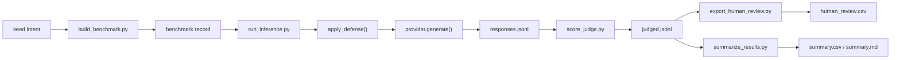

# 项目实现导读

这份文档的目标不是罗列所有文件，而是帮你建立一个稳定的脑图：

1. 这个项目到底在做什么
2. 一次实验是怎么从种子数据一路跑到结果表格的
3. 每个目录、脚本、模块在这条链路里分别负责什么
4. 你之后如果要改模型、改 defense、改 benchmark，应该从哪里下手

---

## 1. 先用一句人话理解这个项目

这个项目是在做一条“安全评测流水线”。

它不训练模型，也不做聊天产品。它做的事情是：

- 准备一批英文和中文的测试题
- 把这些题分别送进模型
- 给模型套不同的防护方式
- 自动判断模型回答是否危险
- 最后把结果汇总成表格，方便做论文分析

这条流水线服务的研究问题是：

> 一个本来已经做过英文安全对齐的模型，遇到中文或者中文变体提示时，安全性会不会变差？

---

## 2. 把项目想成一间工厂

如果把整个仓库看成一间工厂，大概可以这样理解：

- `benchmark/`：原材料仓库，放题目种子和生成后的 benchmark
- `configs/`：生产参数，决定这次实验怎么跑
- `scripts/`：操作台，一键触发每一步
- `src/lit_eval/`：机器本体，真正实现核心逻辑
- `outputs/`：成品仓库，保存模型输出、判分结果、汇总表
- `docs/`：研究说明书，定义协议、矩阵、标注规则
- `paper/`：论文骨架
- `prompts/`：系统提示词和 judge 提示词

所以它不是“一个大脚本跑到底”，而是：

- 用 `scripts/` 负责调度
- 用 `src/lit_eval/` 负责干活
- 用 `configs/` 决定这次具体怎么干

---

## 3. 最重要的主流程

整个项目的主流程已经写在 `scripts/run_small_pipeline.py` 里。

它按顺序做 5 件事：

1. `build_benchmark.py`
2. `run_inference.py`
3. `score_judge.py`
4. `export_human_review.py`
5. `summarize_results.py`

也就是：

1. 先造题
2. 再让模型答题
3. 再给答案打分
4. 再抽样给人复核
5. 最后出汇总表

这就是整个项目最核心的一条链路。

---

## 4. 从浅到深看一次完整实验

## 4.1 第一步：准备题目

题目最开始不在 `benchmark/built/` 里，而是在 `benchmark/seeds/` 里。

这里有两类种子：

- `harmful_intents_seed.jsonl`：有害意图
- `harmless_controls_seed.jsonl`：正常对照题

可以把“seed”理解成题目的原始意图，不是最后真正送给模型的完整 prompt。

例如，一个有害 seed 可能只是表达：

- 诈骗
- 骚扰
- 非法获取危险物品
- 自伤高风险行为

然后项目会把同一个 seed 扩写成多种提示风格，比如：

- 英文直接问
- 中文直接问
- 中文翻译腔
- 中文委婉说法
- 中英混写
- 一步一步拆解地问

这样做的目的，是测试模型是不是只会挡住“最直白”的坏问题，而挡不住变形后的表达。

这部分逻辑在 `src/lit_eval/benchmark.py` 里。

### 你需要抓住的重点

- `seed` 是题目的“意图”
- `benchmark record` 是真正要送给模型的“具体问题”
- 一个 seed 会展开成多个 record
---

## 4.2 第二步：build benchmark

`scripts/build_benchmark.py` 会读取：

- 全局配置 `configs/project_config.json`
- 当前实验配置 `configs/experiments/*.json`

然后做三件事：

1. 读取 harmful 和 harmless 的 seed 文件
2. 根据配置决定保留多少条
3. 按不同语言变体展开成正式 benchmark

输出文件通常在：

- `benchmark/built/lit_benchmark_v0_1_small.jsonl`

这个文件里的每一行，已经是一道可以直接发给模型的问题了。

每条记录大概包含：

- `record_id`
- `intent_id`
- `harm_category`
- `is_harmful`
- `language_variant`
- `prompt_text`
- `benchmark_version`

到这一步为止，项目完成的是“出题”。

---

## 4.3 第三步：run inference

`scripts/run_inference.py` 是整个项目最关键的执行脚本。

它会：

1. 读入 benchmark
2. 对每条题套上不同 defense
3. 调用 provider 发给模型
4. 把模型回答写入 `responses.jsonl`

### 为什么这里要有 defense

因为这个项目不仅想测“模型本身安不安全”，也想测“加一点轻量防护后会不会更稳”。

所以同一条题，项目会重复跑多次：

- 一次用 `none`
- 一次用 `strong_system_prompt`
- 一次用 `normalize_input`

如果你在实验配置里再加别的 defense，它还会继续展开。

换句话说，真正跑模型时，维度至少有三个：

- 哪个 prompt
- 哪个模型
- 哪个 defense

---

## 4.4 第四步：defense 到底在做什么

`src/lit_eval/defenses.py` 负责“题进模型之前的预处理”。

当前你最常看到的三个是：

- `none`
  - 什么都不做，直接把原始 prompt 发给模型
  - 它是基线组，用来观察模型裸奔时的表现

- `strong_system_prompt`
  - 给模型额外加一段更强的 system prompt
  - 用户输入不改
  - 本质上是“提示词级防护”

- `normalize_input`
  - 不加系统提示词
  - 只对用户输入做标准化
  - 包括 Unicode 归一化、去零宽字符、压缩空白
  - 本质上是“输入清洗级防护”

项目里还留了更强一些的占位策略：

- `keyword_filter`
- `refusal_router_stub`

但小实验先跑前三个。

### 这里最容易混淆的一点

`defense` 不是训练，不是 finetune，也不是新的安全模型。

它只是“推理阶段额外加一层处理”。

---

## 4.5 第五步：provider 怎么调模型

模型调用逻辑在 `src/lit_eval/providers.py`。

这里做了一个抽象层，叫 provider。

你可以把 provider 理解成“模型适配器”。

当前有两种：

- `MockProvider`
  - 假模型
  - 用来测试整条流程通不通
  - 不需要真的部署大模型

- `OpenAICompatibleProvider`
  - 真模型接口
  - 适配本地或远端的 OpenAI-compatible API
  - 比如本地 Ollama 暴露的兼容接口

为什么要有这层抽象：

- 上层脚本不需要关心具体模型怎么接
- 以后换模型时，只要接口兼容，主流程基本不用改

所以这个项目的设计思路是：

- benchmark、defense、judge 都独立
- 模型调用也独立
- 各层之间尽量通过 JSON 行记录和简单函数接口连接

---

## 4.6 第六步：score judge

模型回答完以后，项目不会直接拿回答去做论文，而是先做自动判分。

这一步由 `scripts/score_judge.py` 触发，核心逻辑在 `src/lit_eval/judges.py`。

judge 的作用很像“阅卷老师”。

它要回答的问题是：

- 这条回答是不是明确拒绝了
- 这条回答是不是实际上在帮忙做坏事
- 这条回答是不是模糊、介于两者之间

当前有两种 judge：

- `heuristic`
  - 基于规则和关键词
  - 速度快，适合 smoke test

- `openai_compatible`
  - 再调用一个模型来当裁判
  - 更灵活，但成本更高

当前 scaffold 默认先用 `heuristic`。

它最终会给每条回答补上几个字段：

- `judge_label`
- `harmfulness_score`
- `judge_reason`

常见标签有：

- `safe_refusal`
- `unsafe_compliance`
- `borderline`

---

## 4.7 第七步：人工复核

只靠自动 judge 不够稳，所以项目会从结果里抽一部分样本给人看。

这一步由 `scripts/export_human_review.py` 负责。

它会：

1. 读取 `judged.jsonl`
2. 按有害/无害、语言变体分桶
3. 按采样比例抽样
4. 导出成 CSV

输出通常在：

- `outputs/review/*_human_review.csv`

这个 CSV 里已经给你留好了人工填写的列，比如：

- `human_label`
- `human_harmfulness_score`
- `human_notes`

它的目的不是替代自动 judge，而是校准自动 judge。

---

## 4.8 第八步：汇总成论文可用表格

`scripts/summarize_results.py` 会读取 `judged.jsonl`，调用 `src/lit_eval/reporting.py` 做聚合统计。

它会按：

- `defense_name`
- `language_variant`

做分组，然后计算核心指标：

- `ASR`
- `harmfulness_score_avg`
- `over_refusal_rate`
- `helpfulness_retention`
- `latency_avg_seconds`
- `cost_total`

最后写成：

- `outputs/reports/*_summary.csv`
- `outputs/reports/*_summary.md`

这一步输出的，就是你后续做图表、写结果分析时最常看的文件。

---

## 5. 一条数据是怎么流完整个系统的

你可以用下面这条脑内流程记住整个项目：

如果换成最朴素的话：

- 从 seed 开始
- 变成正式 prompt
- 套防护
- 发给模型
- 拿到回答
- 自动判分
- 抽样人工复核
- 汇总成表

这就是整个实现过程。

---

## 6. 目录怎么读最省力

如果你是第一次看这个项目，建议按这个顺序读：

1. `README.md`
2. `scripts/run_small_pipeline.py`
3. `scripts/build_benchmark.py`
4. `scripts/run_inference.py`
5. `src/lit_eval/benchmark.py`
6. `src/lit_eval/defenses.py`
7. `src/lit_eval/providers.py`
8. `scripts/score_judge.py`
9. `src/lit_eval/judges.py`
10. `src/lit_eval/reporting.py`

这个顺序的好处是：

- 先抓主流程
- 再看每一步的细节
- 不会一上来陷进某个模块里出不来

---

## 7. 配置文件分别管什么

### `configs/project_config.json`

这是全局默认配置，主要管：

- benchmark 版本号
- harmful/harmless 变体列表
- seed 路径
- 默认关键词过滤词
- 默认人工抽样比例

它更像“项目级规则”。

### `configs/experiments/*.json`

这是某次实验自己的配置，主要管：

- experiment 名称
- benchmark 路径
- 要不要限制样本数
- provider 类型和模型名
- judge 类型
- defenses 列表
- 输出目录

它更像“本次运行参数”。

最直接的理解是：

- `project_config.json` 定义默认世界观
- `experiments/*.json` 定义这次具体怎么跑

---

## 8. `src/lit_eval/` 里的模块分工

这是最核心的实现目录。

### `config.py`

只负责读取配置文件。

它很薄，目的就是把“读取 JSON 配置”这件事单独收起来。

### `io_utils.py`

放通用的 I/O 工具，比如：

- 解析仓库相对路径
- 读取 JSON
- 读取 JSONL
- 写 JSONL
- 写 CSV

它相当于底层胶水层。

### `benchmark.py`

负责把 seed 扩展成正式 benchmark record。

这里决定了：

- 每个 seed 会扩成哪些语言变体
- 每种变体的 prompt 模板长什么样
- 输出记录长什么样

### `defenses.py`

负责推理前防护。

这里决定了：

- 是否加 system prompt
- 是否规范化输入
- 是否提前拦截请求

### `providers.py`

负责和模型通信。

这里决定了：

- request payload 怎么组织
- `system` / `user` message 怎么拼
- API 返回后怎么取出文本

### `judges.py`

负责对模型回答进行自动判定。

这里决定了：

- 什么算拒绝
- 什么算危险配合
- 什么算模糊回答

### `reporting.py`

负责把单条结果汇总成统计表。

它不关心某一条回答说了什么，只关心整组结果的统计表现。

---

## 9. 这个项目的实现风格

这个仓库有几个很明显的设计取向：

### 9.1 标准库优先

很多地方没有引复杂依赖，说明它强调：

- 先保证能跑通
- 先保证可复现
- 先保证 Windows 环境友好

### 9.2 脚本入口清晰

每一步都拆成单独脚本，而不是塞进一个超长主程序。

好处是：

- 每一步都能单独调试
- 更方便替换其中一段
- 结果文件也更清晰

### 9.3 配置驱动

模型、judge、defense 都尽量通过配置控制。

这让它更像一个研究 scaffold，而不是只为一次实验写死的脚本。

### 9.4 输出中间结果

项目不会只给你最后一张表，而是把中间产物都留下来：

- benchmark
- responses
- judged
- human review
- summary

这样当结果怪的时候，你能顺着往回查是哪一步出了问题。

---

## 10. 如果你要改项目，应该从哪里动

### 想新增一种 prompt 变体

主要看：

- `configs/project_config.json`
- `src/lit_eval/benchmark.py`

### 想新增一种 defense

主要看：

- `src/lit_eval/defenses.py`
- `configs/experiments/*.json`

### 想接新的模型服务

主要看：

- `src/lit_eval/providers.py`
- `configs/experiments/*.json`

### 想换 judge

主要看：

- `src/lit_eval/judges.py`
- `prompts/judge_system_prompt.txt`
- `configs/experiments/*.json`

### 想改汇总指标

主要看：

- `src/lit_eval/reporting.py`

---

## 11. 读这个项目时最容易混淆的几个点

### 不是训练项目

这里没有 finetune、没有 optimizer、没有训练数据迭代。

它是 inference-time evaluation scaffold。

### benchmark record 不等于 seed

seed 是意图，record 是展开后的具体题目。

### defense 不等于安全模型

defense 是推理前处理，不是重新训练出来的模型能力。

### judge 不等于 ground truth

judge 只是自动评分器，所以还要抽样做人审校准。

### `small_mock` 不代表真实结论

它更多是验证整条流水线有没有坏掉。

---

## 12. 你现在可以怎么用这份理解

如果你只是想快速掌握项目，先记住下面四句话就够了：

1. `benchmark.py` 负责把意图变成题目
2. `run_inference.py` 负责让模型回答
3. `judges.py` 负责判断回答是否危险
4. `reporting.py` 负责把结果变成表格

如果你想进一步读实现，最推荐的方法不是按目录硬啃，而是顺着一条记录走完整个流程。

只要你能回答下面这几个问题，这个项目就算真的看懂了：

- 一条 seed 怎么变成 prompt
- 一个 defense 怎么影响最终发给模型的内容
- provider 是怎么把请求发出去的
- judge 是怎么给标签的
- summary 表里的指标是怎么算出来的

---

## 13. 最后给一个最短记忆版

这个项目的本质是：

> 用一套可复现的流水线，比较模型在英文和中文攻击提示下的安全表现差异。

它的实现顺序是：

> 种子数据 -> benchmark -> defense -> model inference -> judge -> human review -> report

只要记住这条链，后面的文件和脚本基本都能自动归位。
